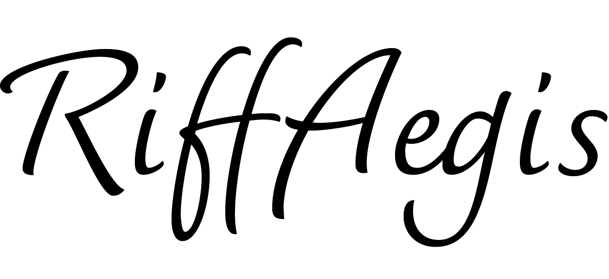

# RiffAegis (リフ・イージス)

<p align="center">
  
</p>

<p align="center">
  <strong>Zero-Retention, Post-Quantum Secure Electronic Signature Architecture</strong><br />
  サーバーに原本を残さない、端末完結暗号化 × 耐量子電子署名基盤
</p>

<p align="center">
  <a href="https://github.com/RiffLink/RIFFAEGIS/actions"></a>
  <a href="https://github.com/RiffLink/RIFFAEGIS"></a>
  <a href="https://github.com/RiffLink/RIFFAEGIS"></a>
  <a href="https://github.com/RiffLink/RIFFAEGIS"></a>
</p>

---

## 🌟 概要 (Overview)

**RiffAegis** は、クラウド運営会社やストレージ事業者が内部不正・サイバー攻撃・司法差押え等に遭った場合でも、**契約書の原本が第三者に決して漏洩・閲覧されない**ことを数学的・暗号理論的に保証する、次世代のオープンソース電子署名プラットフォームです。

従来の一般的な電子契約サービス（クラウドサイン、DocuSign等）では、クラウドサーバー上に契約書の平文PDFが保管される「中央集権型信用モデル」を採用しています。これに対し、RiffAegisは**「サーバー原本非保持（運営者であっても平文を見られないE2EE設計）」**および**「ポスト量子暗号（PQC: 量子コンピュータ耐性）」**を標準搭載しています。

---

## 🛡️ 6つの防御レイヤー (Core Architecture)

| レイヤー | 技術仕様 | 特徴とセキュリティ担保 |
| :--- | :--- | :--- |
| **1. 端末完結・完全非公開暗号化** | AES-256-GCM (Web Crypto API) | ブラウザ端末内で暗号化・復号。平文PDFおよび復号鍵はサーバーへ一切送信されません。 |
| **2. NIST標準 ポスト量子署名** | ML-DSA-65 (FIPS 204 Dilithium) | ショアのアルゴリズムを用いる将来の量子コンピュータでも解読不可能な格子暗号署名。 |
| **3. ハードウェア生体認証** | WebAuthn / FIDO2 Level 3 | Touch ID / Face ID / YubiKey のセキュアエンクレーブと署名鍵をペアリング。なりすまし防止。 |
| **4. 耐改ざん監査ログ** | Merkle Tree Audit Chain | 閲覧、同意、署名の全イベントを SHA3-512 でハッシュチェーン化。1文字の改ざんも即検知。 |
| **5. 世界規模タイムスタンプ** | OpenTimestamps (OTS) / Bitcoin | ビットコインブロックチェーンのカレンダーサーバーにハッシュを刻印し、存在日時を半永久証明。 |
| **6. 暗号化キーストア** | Argon2id + `.riffkey` | 署名鍵をオフラインバックアップ。パスフレーズから Argon2id で鍵導出して安全に保護。 |

---

## 🚀 はじめ方 (Getting Started)

### 動作環境
- Node.js 20.x 以上
- npm 10.x 以上

### インストールと起動

```bash
# リポジトリのクローン
git clone https://github.com/RiffLink/RIFFAEGIS.git
cd RIFFAEGIS

# 依存関係のインストール
npm install

# 開発サーバーの起動
npm run dev
```

ブラウザで `http://localhost:3000` を開くと、RiffAegisが起動します。

---

## 🧪 テストの実行

暗号処理（ML-DSA-65、AES-GCM、Argon2id、Merkleハッシュ）、E2Eフロー、PDF生成、セキュリティテストなど、全33件のユニット・統合テストを実行できます。

```bash
npm test -- --run
```

---

## 🧹 テストデータの削除 (Purge Test Data)

ローカル検証や本番デプロイ後の動作確認で作成したテストデータを、DBおよびストレージから完全に削除できます。

```bash
# ① 特定の契約書IDを指定して削除
npm run purge-test-data <ドキュメントID>

# ② 「テスト」「合意書」などのテスト用データを自動抽出して一括削除
npm run purge-test-data --test

# ③ 全ドキュメントおよび全ストレージファイルを完全初期化
npm run purge-test-data --all
```

また、Web画面上の「**完全削除**」ボタンからも同様にワンクリックで抹消可能です。

---

## 📜 ライセンス (License)

本ソフトウェアは **[PolyForm Noncommercial License 1.0.0 (Source-Available)](LICENSE)** のもとで公開されています。

- **セキュリティ監査・検証・学術・個人利用：** 無償で自由にコードを閲覧・検証・利用できます。
- **商用利用（有償サービスの提供・販売等）：** RiffLink の明示的な商用ライセンス許諾が必要です。商用ライセンスのお問い合わせは `rifflink01@gmail.com` までお願いいたします。
